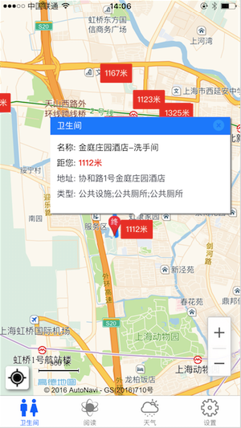
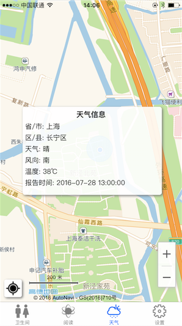
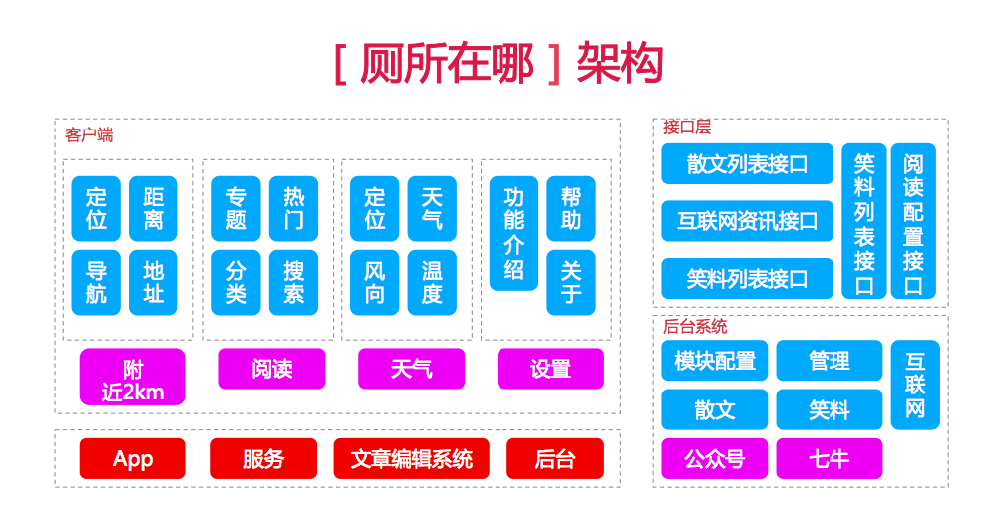

# 厕所在哪      

>## 缘起   

借鉴架构设计和源码，并进行二开。                  
源地址： https://github.com/vczero/toilet.git 

>## 服务端

获取模块列表服务:   
       
	http://localhost:3000/data/read?type=cookies        
	http://localhost:3000/data/read?type=it      
	http://localhost:3000/data/read?type=manager        
	http://localhost:3000/data/read?type=sanwen       

获取首页配置:  
     
	http://localhost:3000/data/read?type=config       

>## 客户端

##### 地图中自动搜索附近2KM以内的卫生间，提供卫生间基础信息，以及路线导航规划。       
            
#### 文章阅读，包含推荐文章和分类                
               
#### 当地的实时天气      
                 
#### App Store (iOS 8.0+)  搜索“厕所在哪” 即可下载            

>## 架构  

